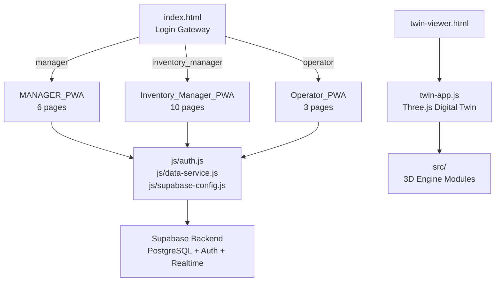
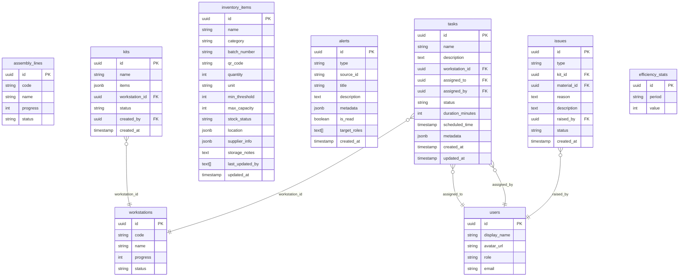
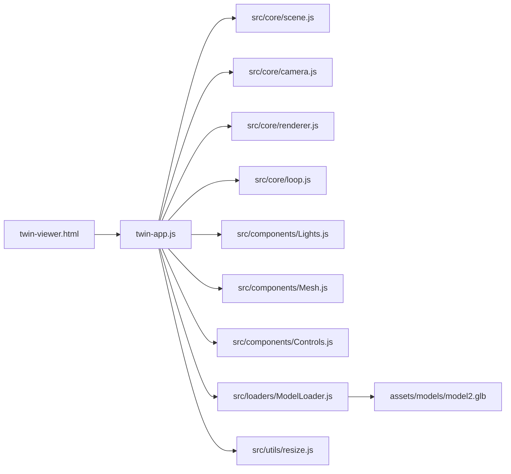

# IM Platform — Complete Project Analysis

## Executive Summary

**IM** (Inventory Management) is a **role-based Progressive Web App (PWA) platform** designed for factory/manufacturing inventory management. It consists of **three separate sub-applications** — one for each user role — unified under a single login gateway, backed by **Supabase** (PostgreSQL + Auth + Realtime), and enhanced with a **Three.js Digital Twin** 3D model viewer.

---

## High-Level Architecture



---

## Technology Stack

| Layer | Technology |
|-------|-----------|
| **Frontend** | Plain HTML/CSS/JS (no framework, no bundler) |
| **Font** | Space Grotesk (Google Fonts) |
| **Backend/DB** | Supabase (PostgreSQL, Auth, Realtime subscriptions) |
| **3D Viewer** | Three.js v0.163.0 (ES modules via CDN import map) |
| **QR Scanning** | html5-qrcode library |
| **PWA** | Service Worker + Web App Manifest |
| **Linting** | ESLint (no-semicolons, single-quotes style) |
| **CI/CD** | GitHub Actions (lint + PWA validation) |
| **Serving** | VS Code Live Server or `npx serve` (no build step) |

---

## Project Structure

```
Mock-main/
├── index.html                  # Login gateway (entry point)
├── gateway.js                  # Mock login (hardcoded users, password "123456")
├── manifest.json               # PWA manifest
├── sw.js                       # Service Worker (offline caching)
├── twin-viewer.html            # 3D Digital Twin viewer page
├── twin-app.js                 # Three.js application logic
├── .eslintrc.json              # ESLint config
├── Setuo.md                    # Team onboarding / contributing guide
│
├── js/                         # Shared services (loaded by all PWAs)
│   ├── supabase-config.js      # Supabase client initialization
│   ├── auth.js                 # IMAuth — login, logout, route guards, RBAC
│   └── data-service.js         # IMData — CRUD for all Supabase tables
│
├── src/                        # Three.js 3D engine (ES modules)
│   ├── core/                   # scene, camera, renderer, animation loop
│   ├── components/             # Lights, Controls (OrbitControls), Mesh (ground)
│   ├── loaders/                # GLB model loader (DRACO compressed)
│   ├── utils/                  # resize handler, math helpers
│   └── styles/main.css         # 3D viewer stylesheet
│
├── assets/                     # 3D assets (models, textures, audio, fonts)
├── icons/                      # PWA icons (192px, 512px)
│
├── MANAGER_PWA/                # Manager role sub-app
│   ├── manager-dashboard.html  # Dashboard with efficiency + WS cards
│   ├── ws-detail.html          # Workstation detail view
│   ├── quick-allot.html        # Create/assign tasks to operators
│   ├── edit-task.html          # Edit an existing task
│   ├── alerts.html             # Alert notifications
│   ├── operators.html          # View all operators
│   ├── css/                    # brand.css, core.css, pages/*.css
│   ├── js/                     # core.js, utils.js, pages/*.js
│   └── assets/                 # SVG icons, avatars, logos
│
├── Inventory_Manager_PWA/      # Inventory Manager role sub-app
│   ├── im-dashboard.html       # Dashboard with WS + Assembly cards
│   ├── inventory.html          # Location view + Stock inventory (tabbed)
│   ├── item-detail.html        # Single item detail view
│   ├── add-product.html        # Add product (manual or scanned)
│   ├── scanned-product.html    # QR scanner → add to stock
│   ├── quick-allot.html        # QR scanner → allot material (step 1)
│   ├── create-kit.html         # Create a kit of materials (step 2)
│   ├── allot-kit.html          # Assign kit to workstation (step 3)
│   ├── ws-detail.html          # Workstation detail with tasks
│   ├── im-alerts.html          # Alert notifications
│   ├── css/                    # brand.css, core.css, pages/*.css
│   ├── js/                     # core.js, pages/*.js
│   └── assets/                 # SVG icons, logos, graphs
│
└── Operator_PWA/               # Operator role sub-app
    ├── home.html               # Task list + efficiency + live clock
    ├── alerts.html             # Alert notifications
    ├── raise-issue.html        # Report machine/material/quality issues
    ├── css/                    # brand.css, core.css, pages/*.css
    ├── js/                     # core.js, pages/*.js
    └── assets/                 # SVG icons, avatars
```

---

## Authentication & Authorization

### Dual-Mode Login

The app has **two login modes** that coexist:

| Mode | File | How it works |
|------|------|-------------|
| **Mock (offline)** | [gateway.js](file:///c:/Users/AYUSH/Desktop/Mock-IM/Mock-main/gateway.js) | Hardcoded users (`manager@test.com`, `im@test.com`, `operator@test.com`) with password `123456`. Stores user in `localStorage`. |
| **Live (Supabase)** | [auth.js](file:///c:/Users/AYUSH/Desktop/Mock-IM/Mock-main/js/auth.js) | Real Supabase Auth (`signInWithPassword`). Fetches role from `users` table. Stores role/name/id in `sessionStorage`. |

> [!NOTE]
> The root `index.html` loads the **Supabase auth** path (auth.js), not gateway.js. The `gateway.js` file appears to be a legacy/mock fallback that isn't currently loaded.

### IMAuth API

```javascript
IMAuth.login(email, password)     // → { user, role, error }
IMAuth.logout(loginPath)          // Signs out, clears session, redirects
IMAuth.getCurrentUser()           // → { id, email, role, display_name }
IMAuth.requireAuth(allowedRoles)  // Route guard — redirects if unauthorized
IMAuth.getRedirectForRole(role)   // Maps role → dashboard URL
```

### Role-Based Access Control (RBAC)

| Role | Redirect Target | Allowed Pages |
|------|----------------|---------------|
| `manager` | `MANAGER_PWA/manager-dashboard.html` | Dashboard, WS Detail, Quick Allot, Edit Task, Alerts, Operators |
| `inventory_manager` | `Inventory_Manager_PWA/im-dashboard.html` | Dashboard, Inventory, Item Detail, Add Product, Scan, Quick Allot, Create Kit, Allot Kit, WS Detail, Alerts |
| `operator` | `Operator_PWA/home.html` | Home, Alerts, Raise Issue |

Every protected page calls `IMAuth.requireAuth(['role'], '../index.html')` at the top of its page-specific JS.

---

## Database Schema (Inferred from data-service.js)



### Key Design Decisions
- **JSONB columns** are used for flexible data: `location` (rack/shelf), `supplier_info` (name/city/po/phone/email), `metadata`, and kit `items`
- **Stock status** is auto-calculated based on quantity vs. threshold ratios (`adequate`, `low`, `critical`, `out_of_stock`)
- **Alerts** use a `target_roles` array to filter which roles see which alerts
- **Realtime subscriptions** are supported via `IMData.subscribe(table, callback)` using Supabase Realtime channels

---

## Data Service Layer (IMData)

[data-service.js](file:///c:/Users/AYUSH/Desktop/Mock-IM/Mock-main/js/data-service.js) provides a centralized CRUD API:

| Domain | Methods |
|--------|---------|
| **Workstations** | `getWorkstations()`, `getWorkstationById(id)`, `getWorkstationByCode(code)`, `updateWorkstation(id, updates)` |
| **Assembly Lines** | `getAssemblyLines()` |
| **Tasks** | `getTasks(filters)`, `getTaskById(id)`, `createTask(data)`, `updateTask(id, updates)`, `deleteTask(id)` |
| **Inventory** | `getInventoryItems(filters)`, `getInventoryItemById(id)`, `createInventoryItem(data)`, `updateInventoryItem(id, updates)` |
| **Users/Operators** | `getOperators()`, `getAllUsers()` |
| **Alerts** | `getAlerts(role)`, `getUnreadAlertCount(role)`, `markAlertRead(id)`, `createAlert(data)` |
| **Kits** | `getKits()`, `createKit(data)` |
| **Issues** | `createIssue(data)`, `getIssues(filters)` |
| **Efficiency** | `getEfficiencyData(period)` |
| **Realtime** | `subscribe(table, callback)`, `subscribeToRow(table, column, value, callback)` |

---

## Page-by-Page Breakdown

### 1. Login Gateway ([index.html](file:///c:/Users/AYUSH/Desktop/Mock-IM/Mock-main/index.html))

- Email + password form
- Auto-redirects if already logged in (`IMAuth.getCurrentUser()`)
- On success, routes to role-specific dashboard
- Registers the service worker

---

### 2. Manager PWA (6 pages)

| Page | Purpose | Data Source |
|------|---------|-------------|
| [manager-dashboard.html](file:///c:/Users/AYUSH/Desktop/Mock-IM/Mock-main/MANAGER_PWA/manager-dashboard.html) | Overview with efficiency bar, graph, WS/Assembly cards | Hardcoded efficiency data (85/72/91%), static cards |
| [ws-detail.html](file:///c:/Users/AYUSH/Desktop/Mock-IM/Mock-main/MANAGER_PWA/ws-detail.html) | Workstation detail with progress ring + task list | Static HTML |
| [quick-allot.html](file:///c:/Users/AYUSH/Desktop/Mock-IM/Mock-main/MANAGER_PWA/quick-allot.html) | Form to assign tasks (WS, operator, task, time) + recent allotments | Static HTML |
| [edit-task.html](file:///c:/Users/AYUSH/Desktop/Mock-IM/Mock-main/MANAGER_PWA/edit-task.html) | Edit an existing task assignment | Static HTML |
| [alerts.html](file:///c:/Users/AYUSH/Desktop/Mock-IM/Mock-main/MANAGER_PWA/alerts.html) | View critical alerts (stock shortages, holds) | Static HTML |
| [operators.html](file:///c:/Users/AYUSH/Desktop/Mock-IM/Mock-main/MANAGER_PWA/operators.html) | Grid of operator cards (name, avatar, age) | Static HTML |

> [!IMPORTANT]
> The Manager PWA's `manager-dashboard.js` has Supabase auth/route guards wired up but **most pages still use static/hardcoded data**. The efficiency filter (Today/Weekly/Yearly) works with local data, and the custom dropdown is functional.

---

### 3. Inventory Manager PWA (10 pages) — **Most feature-complete**

| Page | Purpose | Data Source |
|------|---------|-------------|
| [im-dashboard.html](file:///c:/Users/AYUSH/Desktop/Mock-IM/Mock-main/Inventory_Manager_PWA/im-dashboard.html) | Efficiency bar, graph, WS + Assembly cards | **🟢 Live Supabase** (workstations, assembly_lines, efficiency_stats) |
| [inventory.html](file:///c:/Users/AYUSH/Desktop/Mock-IM/Mock-main/Inventory_Manager_PWA/inventory.html) | Tabbed view: Location grid / Stock list | **🟢 Live Supabase** (inventory_items) |
| [item-detail.html](file:///c:/Users/AYUSH/Desktop/Mock-IM/Mock-main/Inventory_Manager_PWA/item-detail.html) | Full item details (stock, supplier, notes) | **🟢 Live Supabase** (inventory_items by ID) |
| [ws-detail.html](file:///c:/Users/AYUSH/Desktop/Mock-IM/Mock-main/Inventory_Manager_PWA/ws-detail.html) | WS progress ring + linked tasks | **🟢 Live Supabase** (workstations + tasks) |
| [scanned-product.html](file:///c:/Users/AYUSH/Desktop/Mock-IM/Mock-main/Inventory_Manager_PWA/scanned-product.html) | QR code scanner (camera) | html5-qrcode → routes to add-product |
| [add-product.html](file:///c:/Users/AYUSH/Desktop/Mock-IM/Mock-main/Inventory_Manager_PWA/add-product.html) | Form to add item (manual or from scan) | 🔴 Static form (no Supabase insert wired) |
| [quick-allot.html](file:///c:/Users/AYUSH/Desktop/Mock-IM/Mock-main/Inventory_Manager_PWA/quick-allot.html) | QR scanner → step 1 of kit allotment | html5-qrcode → routes to create-kit |
| [create-kit.html](file:///c:/Users/AYUSH/Desktop/Mock-IM/Mock-main/Inventory_Manager_PWA/create-kit.html) | Step 2: select materials for kit | 🔴 Static form |
| [allot-kit.html](file:///c:/Users/AYUSH/Desktop/Mock-IM/Mock-main/Inventory_Manager_PWA/allot-kit.html) | Step 3: assign kit to WS + operator | 🔴 Static form (`alert()` on confirm) |
| [im-alerts.html](file:///c:/Users/AYUSH/Desktop/Mock-IM/Mock-main/Inventory_Manager_PWA/im-alerts.html) | View alerts | 🔴 Static HTML |

---

### 4. Operator PWA (3 pages)

| Page | Purpose | Data Source |
|------|---------|-------------|
| [home.html](file:///c:/Users/AYUSH/Desktop/Mock-IM/Mock-main/Operator_PWA/home.html) | Live IST clock, efficiency, assigned task list with accept/reject/issue buttons | **🟢 Live clock** (IST), auth guard. Tasks are static HTML. |
| [alerts.html](file:///c:/Users/AYUSH/Desktop/Mock-IM/Mock-main/Operator_PWA/alerts.html) | View alerts | 🔴 Static HTML |
| [raise-issue.html](file:///c:/Users/AYUSH/Desktop/Mock-IM/Mock-main/Operator_PWA/raise-issue.html) | Form to report issues (type, kit, material, reason) | 🔴 Static form (`alert()` on submit) |

---

## Three.js Digital Twin Viewer

A standalone 3D model viewer accessible at [twin-viewer.html](file:///c:/Users/AYUSH/Desktop/Mock-IM/Mock-main/twin-viewer.html):

### Architecture



### Features
- **GLB model loading** with DRACO compression support and progress bar
- **HDR environment map** from Polyhaven (studio lighting)
- **Raycaster interaction**: hover highlighting + click selection on mesh parts
- **Info panel**: shows mesh name + vertex count on click
- **Wireframe toggle**: swaps all materials to blue wireframe
- **Move Item panel**: select mesh → set X/Y/Z coordinates → apply position
- **Custom controls**: scroll = rotate, Ctrl+scroll = zoom, drag = orbit
- **Scene**: dark warm background (`#1a1714`), ground plane with grid, fog, 3-point lighting with shadows

---

## Service Worker & PWA

[sw.js](file:///c:/Users/AYUSH/Desktop/Mock-IM/Mock-main/sw.js) implements:

| Strategy | Applied To | Description |
|----------|-----------|-------------|
| **Pre-cache** | All 19 HTML pages + manifest | Cached on install |
| **Network-First** | HTML pages | Fresh content when online, cached fallback |
| **Cache-First** | CSS, JS, images, fonts | Fast loads from cache |
| **Offline fallback** | Any uncached HTML | Branded "You're Offline" page with retry button |

---

## CSS Architecture

Each PWA uses a 3-layer CSS approach:

```
brand.css   → Design tokens (--color-primary: #FF631C, fonts, theme)
core.css    → Shared layout (app-container, headers, bottom-nav, badges)
pages/*.css → Page-specific styles
```

### Brand Colors
| Variable | Value | Usage |
|----------|-------|-------|
| `--color-primary` | `#FF631C` (Orange) | Buttons, accents, active states |
| `--color-bg` | `#FFFFFF` (White) | Page backgrounds |
| `--color-text-main` | `#0F0F0F` (Near-black) | Primary text |
| **Status green** | `#34C759` | Active/adequate status |
| **Status red** | `#FF1744` | Issue/critical status |
| **Status yellow** | `#FFC400` | Hold/warning status |

---

## Navigation Structure

### Manager PWA — 3-tab bottom nav
1. 🏠 Home (Dashboard)
2. 👤+ Quick Allot (Task assignment)
3. 👷 Operators

### Inventory Manager PWA — 4-tab bottom nav
1. 🏠 Home (Dashboard)
2. 📦 Quick Allot (Kit flow)
3. 📷 Scan (QR scanner)
4. 📋 Inventory

### Operator PWA — 1-tab floating nav
1. 🏠 Home

---

## Key Observations

> [!TIP]
> **What's working well:**
> - Clean separation of concerns: shared auth/data layer → role-specific UIs
> - The Inventory Manager PWA has the most complete Supabase integration (dashboard, inventory, item detail, WS detail all pull live data)
> - Supabase Realtime subscription support is built into the data layer
> - The Three.js Digital Twin viewer is fully functional with mesh interaction
> - Service Worker with smart caching strategies
> - QR code scanning with camera + gallery upload

> [!WARNING]
> **Incomplete / Needs Work:**
> - **Manager PWA**: Most pages are static HTML — auth guards work, but task CRUD, operator list, and WS cards aren't wired to Supabase
> - **Operator PWA**: Tasks are hardcoded — no Supabase fetch for assigned tasks
> - **Forms without backends**: `add-product.html`, `create-kit.html`, `allot-kit.html`, `raise-issue.html`, `quick-allot.html` (Manager) — all submit via `alert()` or direct navigation without saving to DB
> - **Alerts pages**: All three roles show static hardcoded alerts
> - **`gateway.js`** is loaded nowhere — appears to be a dead/leftover mock file
> - **`core.js`** files in all three PWAs are **empty** (0 bytes) — placeholder files
> - Some page JS files (`MANAGER_PWA/js/pages/alerts.js`, `quick-allot.js`, `ws-detail.js`) are **empty** (0 bytes)
> - The `inventory.html` page loads **both** inline `<script>` tab switching AND an external `inventory.js` that duplicates the same `switchTab()` function
> - The Digital Twin viewer is standalone — not yet integrated into any PWA dashboard

---

## Supabase Configuration

| Setting | Value |
|---------|-------|
| **URL** | `https://vrmhrdoabmxbacjmfugk.supabase.co` |
| **Anon Key** | Present in [supabase-config.js](file:///c:/Users/AYUSH/Desktop/Mock-IM/Mock-main/js/supabase-config.js) |
| **Auth Method** | Email/Password |
| **SDK** | `@supabase/supabase-js@2` (CDN) |

---

## Summary: File Count by Category

| Category | Files | Lines (approx) |
|----------|-------|----------------|
| HTML pages | 20 | ~2,000 |
| JavaScript (shared) | 3 | ~590 |
| JavaScript (page-specific) | 11 | ~750 |
| JavaScript (Three.js) | 8 | ~500 |
| CSS files | 20+ | ~3,500 |
| Config / Meta | 4 | ~350 |
| **Total** | **~66 files** | **~7,700 lines** |
